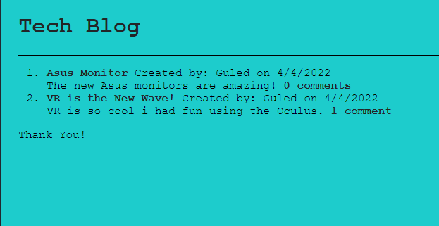

# Tech-Blog

## The Motivation

This project has grown my skills in my overall understanding of fullstack development. Making this application has given me the insight to be able to make a full scale project all on my own.

## Challenges

There were many things I had to figure out and fix when making this app because of the numerous files used to make it. For one, getting the routes to do what they were suppsoed to do brought me many errors. Another issue I faced was getting the handlebars to do what I wanted. It has been a joy creating this app and my coding skills have grown tremendously through this.

## Screenshot

## Link
https://damp-inlet-92456.herokuapp.com/

